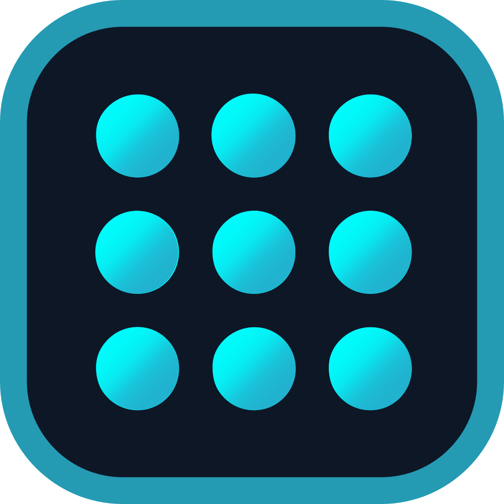

<p align="center">
  
</p>

<h1 align="center">CyberTray — System Tray Launcher</h1>

<p align="center">
  <strong>A shortcut launcher and dock</strong> — animated shelf that slides out from your screen edge, with system monitoring, process management, and a secure file vault.
</p>

<p align="center">
  <a href="https://github.com/CyberGems/CyberTray/releases/latest">
    
  </a>
  <a href="https://github.com/CyberGems/CyberTray/releases">
    
  </a>
</p>

<p align="center">
  
  
  
  <a href="https://github.com/CyberGems/CyberTray/wiki"></a>
</p>

A **system tray shortcut launcher and dock** for Windows. CyberTray provides a sleek, animated shelf that slides out from the top or bottom of the screen, allowing you to organize, search, and launch applications, files, and URLs — all wrapped in a stunning neon glassmorphic interface.

*Free and open source — no ads, no tracking, and no data collection. Just enjoy it.*

---

## 🎯 Why CyberTray?

Your desktop is cluttered. The Start Menu is slow. The taskbar is full. CyberTray gives you a **dedicated launchpad** that stays out of the way until you need it — then slides out with a smooth animation, ready to launch anything in milliseconds.

| Need | Solution |
|---|---|
| Quick access to apps & files | Animated shelf with search, categories, and drag-and-drop import |
| Save taskbar space | System tray icon + auto-hiding shelf |
| Launch from anywhere | Global hotkey (`Alt+T`) and hot corners |
| Monitor your system | Real-time RAM, CPU, disk, and VRAM telemetry |
| Manage running processes | Process viewer with kill functionality |
| Secure sensitive files | PIN-protected vault with desktop sweep |
| Make it yours | 5 neon themes, custom backgrounds, grid or list layout |

---

## ✨ Key Features

### 🚀 Shortcut Launcher
- **Shortcut Management** — Register, edit, and launch applications, files, and URLs
- **Drag & Drop Import** — Drag files or executables directly into the shelf
- **Categories & Folders** — Organize shortcuts with nested folder support
- **Favorites System** — Mark shortcuts for quick access
- **Group Launch** — Launch all shortcuts in a category at once
- **Multi-Selection** — Bulk delete with selection mode (`Ctrl+A`, `Escape`)
- **Real-Time Search** — Instant filtering across all shortcuts
- **Sort Options** — Alphabetical, most used, recently added

### 🔲 Hotspots (Screen Corners)
- **Corner activation** — Trigger CyberTray by dwelling cursor in any screen corner
- **Configurable delay** before activation
- **UAC secure desktop guard** — Auto-hides when UAC prompt appears

### 📊 Neural Telemetry (System Monitoring)
- **RAM Usage** — Real-time progress bar with percentage
- **CPU Info** — Model and core count
- **Disk Space** — Per-drive monitoring via WMI
- **VRAM Detection** — Background GPU memory fetch
- **System Uptime** — Track since last boot

### ⚙️ Process Matrix
- **Running Processes** — View PID, name, and memory usage
- **Kill Processes** — Terminate directly from the list
- **Search & Sort** — Find processes quickly

### 🔐 Cyber-Vault (Secure Files)
- **PIN Protection** — 4-digit PIN to lock/unlock the vault
- **Desktop Sweep** — Move all desktop files/folders to the secure vault
- **Auto-Lock Timeout** — Configurable (immediate, 1min, 5min, 15min, session)
- **Custom Vault Path** — Store vault files in any location

### 🎨 Appearance Customization
- **5 Neon Themes** — Netrunner Cyan, Synthetic Purple, Sandevistan Amber, Arasaka Crimson, Maelstrom Emerald
- **Background Types** — Solid color, gradient presets, 4 built-in image presets, custom image
- **Blur Level** — Adjustable backdrop blur intensity
- **Opacity** — Background transparency control
- **Icon Size** — Adjustable grid icon sizing
- **View Modes** — Grid or list layout

### 🔊 Sound System
- **Launch Sound** — Default chime on shortcut launch
- **Custom Audio** — MP3, WAV, OGG, AAC, M4A support
- **Folder Navigation Sounds** — Audio feedback when browsing categories

### 💾 Data Management
- **Backup & Restore** — Export/import configuration as JSON (with embedded icons)
- **In-app Updates** — Check, download, and install from About via GitHub Releases (`electron-updater`). Auto-check on boot notifies you; install is always confirmed.
- **Bilingual UI** — Full English and Spanish interface

---

## 🛠️ Tech Stack & Architecture

- **Platform:** Windows 10 / 11
- **Framework:** Electron 42 + React 19 + TypeScript
- **Bundler:** Vite 6
- **Styling:** CSS custom properties with glassmorphism effects
- **Architecture:** Single shelf window with system tray integration

```
CyberTray/
├── electron/
│   ├── main.ts           Main process (windows, tray, IPC, hotspots, icons)
│   ├── preload.ts        Context bridge (IPC API)
│   └── updater.ts        Auto-update via GitHub Releases
├── src/
│   ├── App.tsx           Main application component
│   ├── main.tsx          React entry point
│   ├── locales.ts        i18n (English / Spanish)
│   ├── lib/appUtils.ts   Utility functions
│   ├── components/
│   │   ├── ShortcutGrid.tsx      Main shortcut display grid
│   │   ├── ShortcutFormModal.tsx Add/edit shortcut dialog
│   │   ├── SettingsPanel.tsx     Configuration modal
│   │   ├── TelemetryBar.tsx      System metrics footer
│   │   ├── ProcessMatrixModal.tsx Process viewer/killer
│   │   ├── VaultPanel.tsx        Secure file vault settings
│   │   ├── PinPadModal.tsx       PIN entry for vault
│   │   ├── AboutModal.tsx        Version and update info
│   │   ├── FolderTree.tsx        Category/folder navigation
│   │   ├── ToastStack.tsx        Notification toasts
│   │   └── CyberTrayLogo.tsx     Animated logo
├── public/               Static assets & icons
└── vite.config.ts        Vite configuration
```

### Window Architecture

| Window | Purpose | Behavior |
|---|---|---|
| **Shelf** | Main shortcut panel | Resizable, always-on-top, slide animation |

Communication between frontend and backend uses Electron IPC via `contextBridge`. Hotspot polling runs at 200ms intervals. UAC guard monitors for `consent.exe` to auto-hide during secure desktop sessions.

---

## 🚀 Getting Started

### Prerequisites

- [Node.js](https://nodejs.org/) v22+
- npm

### Development

```bash
git clone https://github.com/CyberGems/CyberTray.git
cd CyberTray
npm install
npm run dev
```

### Build for Production

```bash
npm run build
npm run build:electron
```

The installer will be in the `release/` directory.

### 🛡️ Windows SmartScreen

Windows may show a SmartScreen warning the first time you run the CyberTray installer — this is an unsigned hobby app, so Windows hasn't built reputation for the file yet. This is expected; the source is public so you can inspect exactly what it does.

To continue:

1. Click **More info**.
2. Click **Run anyway**.

---

## ⌨️ Keyboard Shortcuts

| Key | Action | Scope |
|---|---|---|
| `Alt+T` (default) | Toggle CyberTray shelf | Global |
| `Escape` | Exit selection mode | Application |
| `Ctrl+A` | Select all shortcuts | Selection mode |

---

## ❓ Frequently Asked Questions

### What is CyberTray?

CyberTray is a system tray application launcher for Windows. It provides an animated shelf that slides out from your screen edge, giving you quick access to organized shortcuts, system monitoring, process management, and a secure file vault.

### How do I show/hide CyberTray?

Click the system tray icon or use the global hotkey (`Alt+T` by default). You can also configure hot corners to trigger it by dwelling your cursor in a screen corner.

### How do updates work?

CyberTray can check GitHub Releases on boot and notify you when a new version is available. From About you can download the update in-app and install it with a restart. Automatic install is off — you always confirm.

### How does the Cyber-Vault work?

The Cyber-Vault is a PIN-protected folder for storing sensitive files. You can enable PIN protection in Settings → Vault, set an auto-lock timeout, and use the "Desktop Sweep" feature to move all desktop files into the vault.

### Can I import my existing shortcuts?

Yes. Drag and drop `.exe` or `.lnk` files directly into the shelf to add them. You can also organize shortcuts into categories and folders.

### Does CyberTray support multiple monitors?

Yes. You can choose which display CyberTray appears on, or use "Follow cursor" mode to show it on whichever screen your mouse is on.

---

## ❤️ Donate

**CyberTray** is one of the gems in [CyberGems](https://github.com/CyberGems#-all-apps--repositories), a personal suite I've spent thousands of hours building and refining for my own use. I've decided to share the whole suite with the world — completely free and open-source.

If you'd like to support this work, a donation would mean a lot. Thank you! 🙏

<p align="center">
  <a href="https://www.paypal.com/donate/?hosted_button_id=M4PY3UPJA5Y6Q"></a>
</p>

<p align="center">
  <a href="https://ko-fi.com/cybergems"></a>
</p>

<p align="center">
  <a href="https://buymeacoffee.com/cybergems"></a>
</p>

<div align="center">

<details>
<summary><b>Crypto donations (BTC, ETH, USDT, LTC) — click to view addresses</b></summary>

<div align="left">

| Asset | Network | Address | QR |
|---|---|---|---|
|  **BTC** | Bitcoin | `bc1q5mxzz05nmvsheqzx7970euswta3fksxzcfzag4` |  |
|  **ETH** | Ethereum (ERC20) | `0x79b703Ec0f77493679Fcd280aF3b983E20c580B8` |  |
|  **USDT** | Ethereum (ERC20) | `0x79b703Ec0f77493679Fcd280aF3b983E20c580B8` |  |
|  **USDT** | BNB Smart Chain (BEP20) | `0x79b703Ec0f77493679Fcd280aF3b983E20c580B8` |  |
|  **USDT** | Tron (TRC20) | `TSVbSk1HSyZ1NprCnAYiw56ECwXgH887mD` |  |
|  **LTC** | Litecoin | `LWGnEHgcFCE2BRkzLnsdPDD8Y8ZeDK577X` |  |

> ⚠️ Send only the selected asset on the indicated network. Using the wrong network will result in permanent loss of funds.

</div>

</details>

</div>

---

<div align="center" style="background:#0D0F17; border:1px solid rgba(0,255,255,0.12); border-radius:12px; padding:28px 20px; margin-top:32px;">

### Thanks for using CyberTray! 🎉

Made by [**CyberGems**](https://cybergems.org)

</div>
